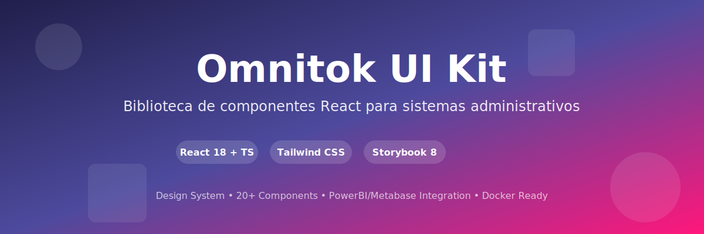

# Omnitok UI/UX Project



<div align="center">

**Biblioteca completa de componentes React y sistema de diseño para aplicaciones administrativas internas**

[](https://www.docker.com/)
[](http://localhost:8080)
[](https://react.dev/)
[](https://www.typescriptlang.org/)
[](https://tailwindcss.com/)

</div>

---

## 📁 Estructura del Proyecto

```
.
├── omnitok-ui/              # UI Kit principal (monorepo)
│   ├── packages/core/       # Biblioteca de componentes React (@omnitok/ui)
│   ├── apps/storybook/      # Documentación interactiva
│   ├── Dockerfile           # Para deployar Storybook
│   └── README.md            # Documentación completa del UI Kit
│
├── legacy/                  # Archivos legacy (referencia histórica)
│   ├── design-system/       # Docs en Markdown (deprecado)
│   ├── examples/            # Ejemplos HTML (deprecado)
│   └── figma/               # Exports de Figma y logos
│
└── .cursor/rules/ui-ux.mdc  # Reglas de UI/UX para Cursor
```

## 🎯 Fuente Única de Verdad

**Storybook** es ahora la fuente única de verdad para:
- Sistema de diseño (colores, tipografía, layout, íconos, patrones)
- Documentación de componentes
- Ejemplos de uso
- Guías de integración (PowerBI, Metabase)
- Cursor Rules

## 🚀 Inicio Rápido

### Ver Documentación

```bash
cd omnitok-ui
pnpm install
pnpm storybook
```

Abre http://localhost:6006

### Usar en Tu Proyecto

```bash
npm install @omnitok/ui lucide-react
```

Ver documentación completa en: `omnitok-ui/README.md` y `omnitok-ui/GETTING_STARTED.md`

## 🐳 Docker

### Generar imagen

```bash
cd omnitok-ui
docker build -t omnitok-ui-storybook:latest .
```

### Desplegar

```bash
docker run -d -p 8080:80 omnitok-ui-storybook:latest
```

Acceder en: http://localhost:8080

## 📚 Recursos

- **GitHub**: https://github.com/pervasivemind/omnitok-ui-kit
- **Storybook Live**: https://pervasivemind.github.io/omnitok-ui-kit
- **NPM Package**: `@omnitok/ui` (cuando se publique)

## 📂 Legacy

La carpeta `legacy/` contiene archivos históricos:
- `design-system/` - Documentación en Markdown (ahora en Storybook)
- `examples/` - Ejemplos HTML (ahora en Storybook como React)
- `figma/` - Exports de Figma y **logos** (usa estos logos en tus proyectos)

## 🎨 Logos

Los logos están en `legacy/figma/`:
- `logo_largo_blanco.png` - Sidebar expandido
- `logo_cuadrado_color.png` - Sidebar colapsado
- `logo_largo_color.png` - Login

## 📝 Licencia

MIT © Omnitok
